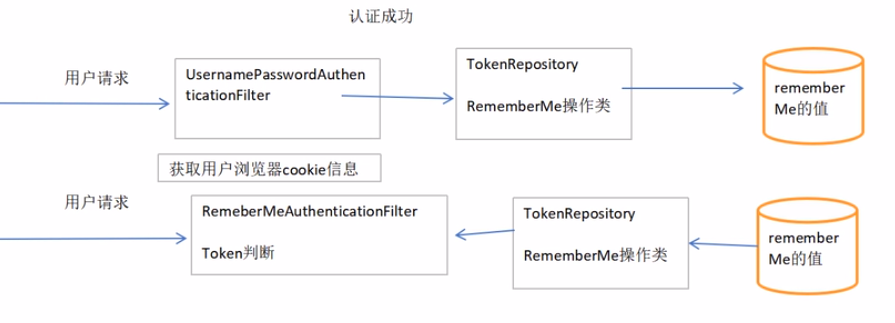

# Spring-Security-Learn2
## 项目源码包含三个模块
- [x] spring-security-01-ssm : show how to use spring security on SSM by XML settings.
- [x] spring-security-02-ssm
- [x] spring-security-03-springboot

## 未使用安全框架时流程

## Spring Security 执行流程（大体上）

## 记住我执行流程

## ps
本来打算按课程写分支的，写的很乱，就全删除了，只保留最后的成果