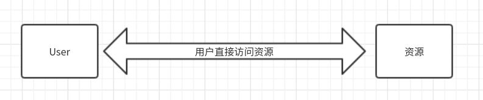
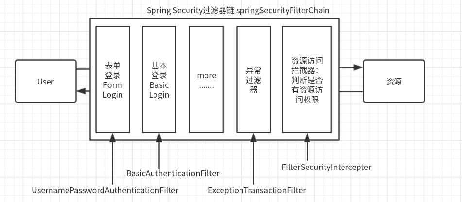

# Spring-Security-Demo-3pcs
## The Project has three modules.  
- [ ] spring-security-01-ssm : show how to use spring security on SSM by XML settings.

## The Branch
Those braches is the lesion of class.

## Before Using Spring Security

## Spring Security Executing Processes

